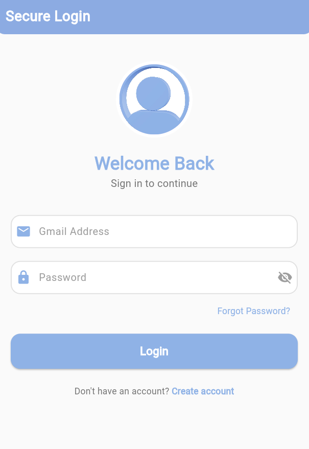
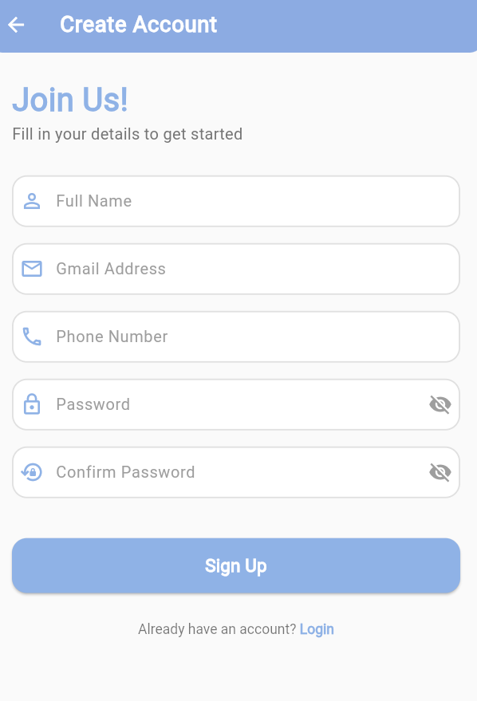
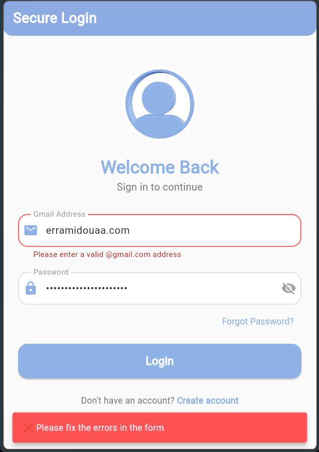
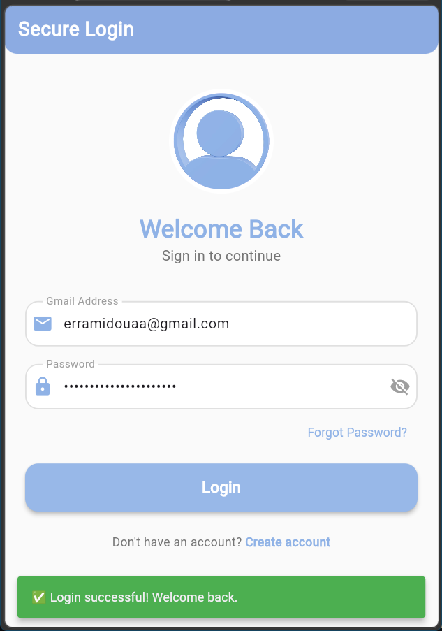
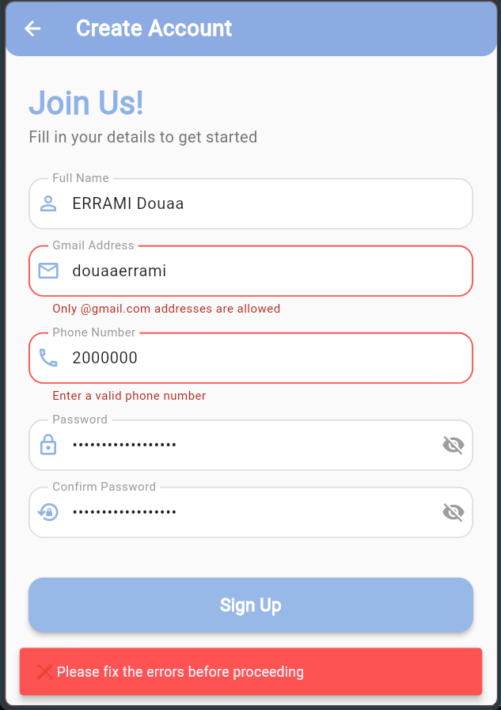
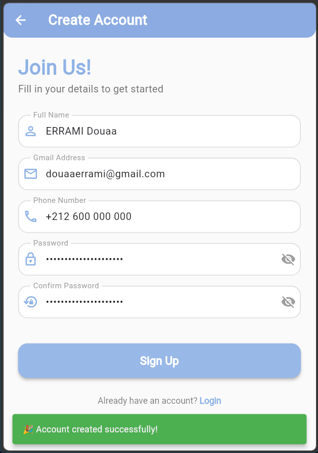

# Login & Signup Flutter App


A professional, production-ready authentication UI boilerplate built with Flutter. This project demonstrates high-standard UI/UX principles, real-time input validation using Regular Expressions, and a polished feedback system for error handling.

## 📱 App Preview

### 🎬 Demo Video
Experience the smooth animations and real-time validation in action:

<p align="center">
  <video src="assets/app-screens/demo_login-Signup_UI.mp4" width="350" controls>
    Your browser does not support the video tag.
  </video>
</p>

### Authentication Screens
<p align="center">
  
  
</p>

### Validation & Error Handling
Showcasing real-time validation states (Success/Error) and user notifications via SnackBars.
<p align="center">
  
  
  
  
</p>

## 🚀 Features

- **Enterprise-Grade UI**: Modern and clean interface using the primary brand color `#8fb2e6`.
- **Robust Validation System**: 
  - **Gmail-Only Validation**: Strict regex to ensure only `@gmail.com` addresses are accepted.
  - **Password Rules**: Minimum 6 characters and matching confirmation check.
  - **Phone Formatting**: Numeric-only validation with length checks.
- **Visual Feedback System**: 
  - **Border States**: Green borders for valid inputs and Red for errors.
  - **Inline Error Messages**: Clear validation text directly under the input fields.
  - **SnackBar Notifications**: Professional alerts for form submission results.
- **Dynamic Micro-Animations**: Floating profile image effects using `AnimationController`.
- **Responsive Design**: Adaptive layouts using `SingleChildScrollView` for seamless use on all screen sizes.
- **UX Optimization**: Context-aware keyboards (Email, Phone, Secure Password).

## 🛠 Tech Stack

- **Framework:** [Flutter](https://flutter.dev)
- **Language:** [Dart](https://dart.dev)
- **Components:** Material Design 3, AnimationController, Tween API.
- **State Management:** StatefulWidget (Standard local state management).

## 🏗 Project Architecture

The project follows a clean, modular structure:

- **`LoginScreen`**: Orchestrates the login flow and entry animations.
- **`SignupScreen`**: Manages comprehensive registration with cross-field validation.
- **`CustomInputField`**: A reusable, production-ready widget that encapsulates validation styling and logic.
- **`lib/AppScreens/`**: Centralized repository for UI screenshots and media.

### Operational Flow
`User Input → Logic Validation (Regex) → State Update → UI Re-render (Success/Error States) → Feedback (SnackBar)`

## 🧠 Key Concepts

- **StatefulWidget**: Used for dynamic input fields that require immediate UI updates.
- **AnimationController & Tween**: Logic used to create the "Floating" profile effect on the login page.
- **TextEditingController**: Handles data retrieval and field manipulation.
- **GlobalKey<FormState>**: Triggers validation across the entire form upon button click.
- **Navigator push/pop**: Handles the smooth transition between auth screens.
- **setState()**: Manages the local UI state for validation borders and icons.

## 📥 Installation

1. **Clone the repository:**
   ```bash
   git clone https://github.com/yourusername/loginpage_flutter.git
   ```
2. **Install dependencies:**
   ```bash
   flutter pub get
   ```
3. **Configure Assets:**
   Verify your `pubspec.yaml` contains:
   ```yaml
   flutter:
     assets:
       - assets/profile.jpg
       - lib/app-screens/
   ```
4. **Run the app:**
   ```bash
   flutter run
   ```

## 🔮 Future Roadmap

- [ ] **Firebase Auth**: Connect to a real-time authentication backend.
- [ ] **Dark Mode**: Provide a high-contrast dark theme.
- [ ] **Biometrics**: Support for Fingerprint/FaceID login.
- [ ] **State Management**: Migration to Bloc or Provider for larger scale.

## 📜 License

**Copyright © 2026 Douaa ERRAMI. All Rights Reserved.**

This project is proprietary and confidential. Unauthorized copying, modification, or distribution is strictly prohibited. For permission requests, please contact the author.

---

**Developed by [Douaa ERRAMI](https://github.com/Douaa0504)** — *Crafting Next-Generation Android Experiences.*
⭐ **Star this repository if you find it impressive!**